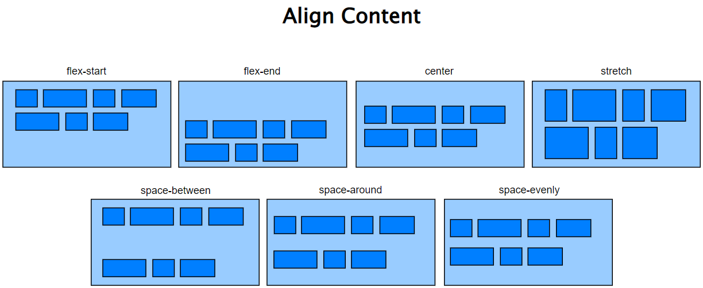

# Flexbox

## Propriedades do elemento pai


### **display**
---

```
.container {
    display: flex;
}
```

### **flex-direction**
---

```
.container {
  flex-direction: row | row-reverse | column | column-reverse;
}
```

### **flex-wrap**
---


```
.container {
  flex-wrap: nowrap | wrap | wrap-reverse;
}
```

### **flex-flow**
---
É uma propriedade que agrupa o **flex-direction** e **flex-wrap**

```
.container {
  flex-flow: column wrap;
}
```

### **justify-content**
---


```
.container {
  justify-content: flex-start | flex-end | center | space-between | space-around | space-evenly;
}
```

### **align-items**
---


```
.container {
  align-items: flex-start | flex-end | center | stretch | baseline;
}
```

### **align-content**
---


```
.container {
  align-content: flex-start | flex-end | center | stretch | space-between | space-around | space-evenly;
}
```

### **gap, row-gap, column-gap**
---


```
.container {
  gap: 10px;
}

.container {
  gap: 10px 30px; /* row-gap column gap */
  /* row-gap: 10px; */
  /* column-gap: 30px;  */
}
```


## Propriedades do elemento filho

### **order**
---


```
.item {
  order: 2;
}
```

### **flex-grow**
---
É a habilidade de um item crescer/expandir


```
.item {
  flex-grow: 2;
}
```

### **flex-shrink**
---
É a habilidade de um item diminuir/encolher

```
.item {
  flex-shrink: 2;
}
```

### **flex-basis**
---
Define o tamanho de um elemento
O tamanho pode ser em % ou px, rem... ou auto

```
.item {
  flex-basis: 20px | auto;
}
```


### **flex**
---

É uma propriedade que agrupa o **flex-grow**, **flex-shrink** e **flex-basis**

O valor padrão é o abaixo

```
.item {
  flex: 0 1 auto;
}

.item {
  flex: 1;
}
```

### **align-self**
---

Igual ao align-items, só que para um unico elemento

```
.item {
  align-self: auto | flex-start | flex-end | center | baseline | stretch;
}
```
